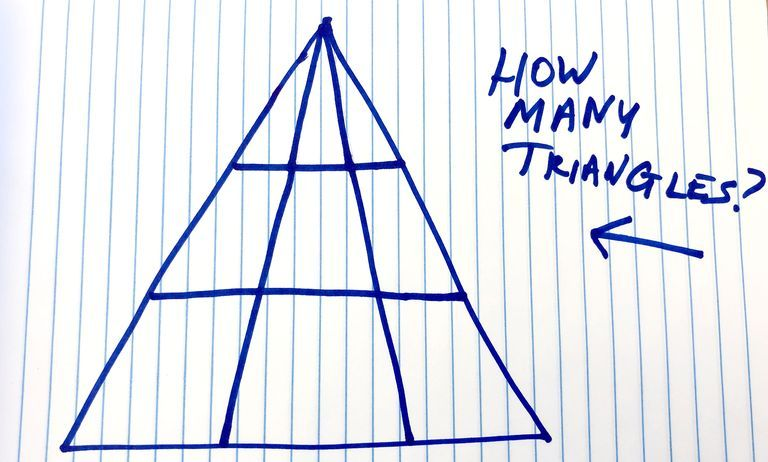
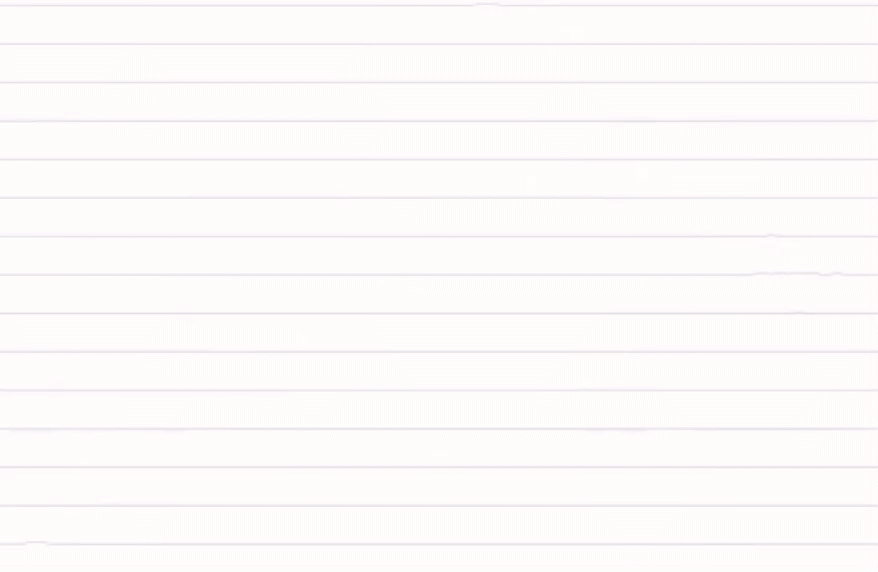
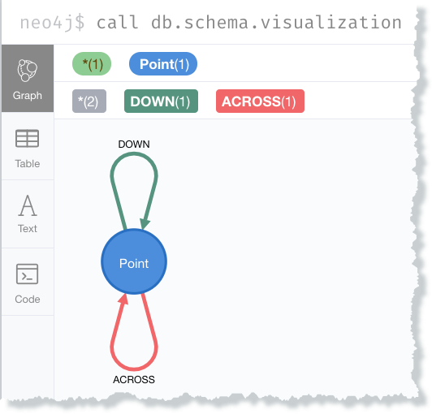
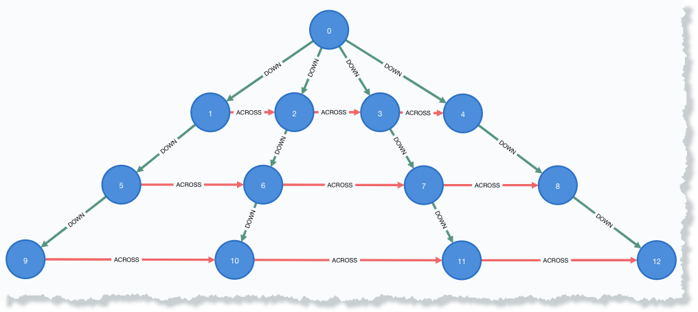
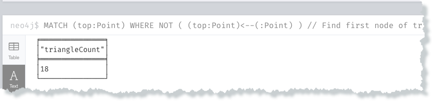
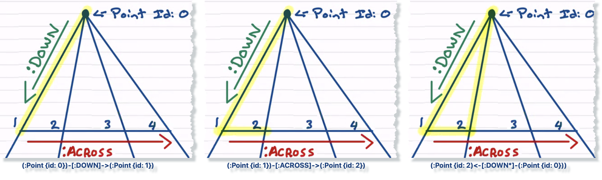
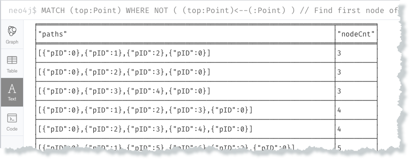
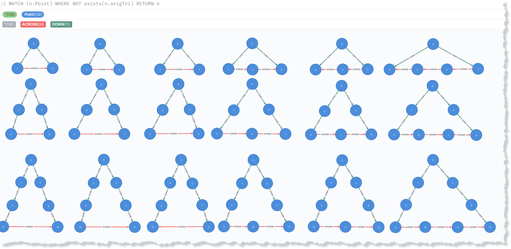

# cypher-counting-triangles

----
## Overview

This repo contains the Neo4j Cypher code for the [medium.com post](https://medium.com/neo4j/using-the-neo4j-graph-database-and-cypher-to-solve-this-brain-teaser-why-argue-350fde86da14)  on using the Neo4j graph database and the Cypher query language to count the number of triangles as described in this Popular Mechanics's [post](https://www.popularmechanics.com/science/math/a30706968/viral-triangle-brain-teaser-solved/). The goal is to count the total number of sub-triangles in this diagram.



The diagram below represents the conceptual model of a graph for the original triangle drawing problem statement.



----
### Creating Data

:exclamation: To run the following code you'll need to be familiar with how to create a Neo4j database and run Cypher commands.  A good starting point is the Neo4j [developer guides](https://neo4j.com/developer/get-started/).  Sections include how to install the [Neo4j Desktop](https://neo4j.com/download/) locally or use a free [Neo4j Sandbox](https://neo4j.com/sandbox/) instance in the cloud.

Nodes and labels are created in the Neo4j graph database to represent the drawing as a graph. The data represents 3 triangles divided by two horizontal lines to give 3 levels. There are two ways to create the data provided:

1. Parameter driven, presented here and found the file `createDataCypher\1-crTriangle.cypher`

2. Manually found in the file `createDataCypher\other-manualCrTriangle.cypher`  

The default is to create the same pattern as in the to match the original Popular Mechanics<sup>TM</sup> post. Edit the Cypher query found in `1-crTriangle.cypher` and modify the parameters `nbrTriangles` and `nbrLevels` if you want to create data the represents a different pattern than the 3 triangles x 3 levels.

:warning: You will have `enable multi statement query editor` enabled in the Neo4j Browser for the script to work.

Cypher code to create the triangle data in the graph using the `$nbrTriangles` and `$nbrLevels` parameters:

```
:param nbrTriangles => 3;
:param nbrLevels => 3;

// Create a triangles with nbrTriangles at each level for nbrLevels
// nbrTriangles: cypher parameter is the number of sub-triangles (vertical lines)
// nbrLevels: cypher parameter is the number of sub-triangle (horizontal line) levels
// nbrPoints = $nbrLevels x ($nbrTriangles + 1)

// Start with a blank database! Next statement clears all nodes and relationships
MATCH (n) DETACH DELETE n;

// create 2nd level to bottom of triangle relationships (it's really a grid)
WITH $nbrLevels * ($nbrTriangles + 1) AS nbrPoints,
     $nbrTriangles + 1 AS nbrSides
UNWIND range(1,$nbrTriangles) AS i  // across
  UNWIND range(0, nbrPoints - 1, nbrSides ) AS j  // down
    MERGE(left:Point {pID: i + j})
    MERGE(across:Point {pID: i + j + 1})
    MERGE (left)-[:ACROSS]->(across)
    WITH left, across, nbrPoints, nbrSides
    WHERE left.pID < (nbrPoints - $nbrTriangles )
      AND $nbrLevels > 1
        MERGE (leftDown:Point {pID: left.pID + nbrSides})
        MERGE (acrossDown:Point {pID: across.pID + nbrSides})
        MERGE(left)-[:DOWN]->(leftDown)
        MERGE(across)-[:DOWN]->(acrossDown);

// create 1st level (top) of triangle, a.k.a. "node 0"
CREATE(top:Point {pID: 0})
WITH top, $nbrTriangles + 1 AS nbrSides
UNWIND range(1,nbrSides) AS idx
  MATCH(bottom:Point {pID: idx})
  MERGE (top)-[:DOWN]->(bottom);
```
_(file: createDataCypher/1-autoCrTriangle.cypher)_

### Visualizing The Triangles Represented In The Graph
The schema for the data created can be visualized using the `db.schema.visualization` function once the data creation queries are run:



Run the cypher statement `MATCH (n) RETURN n` and arrange the nodes to visualize the data as a triangle:



### Counting the Embedded Triangles

#### Returning Count of All Triangles

Run the query below and verify that the totalTriangleCount value is ***18***.   
```
MATCH (top:Point) WHERE NOT ( (top:Point)<--(:Point) )  // Find first node of triangle, has no incoming relationships
MATCH path=(top)-[:DOWN*]->(:Point)-[:ACROSS*]->(:Point)<-[:DOWN*]-(top)
RETURN count(path) AS triangleCount
```
_(file: countTriangleCypher/2-cntSubTriangleNodes.cypher)_



The query consists of two `MATCH` statements. The first finds the node that represents the top of the triangle, a.k.a. 'Node 0' which is the `:Point` labeled node with the property `pID: 0`. The second traverses the graph and returns the path that matches the cypher pattern for a triangle. Cypher allows the chaining of individual statements together and reference results along the execution path. A more complete description is in the [Neo4j documentation](https://neo4j.com/docs/cypher-manual/current/syntax/variables/#cypher-variables).

##### First `MATCH` statement - find the "top" of the triangle

```
MATCH (top:Point) WHERE NOT ( (top:Point)<--(:Point) )
```

The pattern in the `WHERE` clause, `WHERE NOT ( (top)<--(:Point) )` represents all `:Point` nodes that do not have incoming relationships. There are only `:Point` nodes in this database, but including the label `:Point` in the node query pattern(s) is good a good practice if you know what labels you want. There is only one node in this database that is our 'node 0', referenced in the query variable `top`.

It would easiest to get the node representing the top of the triangle by explicitly querying for the `:Point` node with `pID: 0` with the cypher statement `MATCH (top:Point { pID: 0 } )...` or `MATCH (top:Point) WHERE top.Id = 0...`. Hardcoding anything is an anti-pattern for pattern queries IMHO.  

##### Second `MATCH` statement - traverse triangle patterns

```
 MATCH path=(top)-[:DOWN*]->(:Point)-[:ACROSS*]->(:Point)<-[:DOWN*]-(top)
```

The next `MATCH` cypher pattern returns all the closed triangle paths starting at the `top` node in the `paths` variable  Count the number of paths, and you have the triangle count we're looking for.

This cypher query pattern is simply a translation of how to trace triangles on a piece of paper. Or in graph concept terms "find all the paths through the graph that traverse downward from the top point to the next point, then traverse right, then traverse back to the top".  Repeat this pattern until you've covered all the traversal possibilities you can find. A visual sequence for the first traversal and cypher query patterns is below. Remember the variable `top` is the node `(:Point {pID: 0})` found with our first `MATCH` statement.



  1. Traverse the `:DOWN` relationship directionally indicated by `->` from the `top` node. This is done through any number of hops as indicated by the `*` modifier. The first traversal is: `(:Point {pID: 0})-[:DOWN]->(:Point {pID: 1})`

  2. Traverse the `:ACROSS` relationship directionally indicated by `->` from the current `:Point` node.  This part of the traversal is `(:Point {pID: 1})-[:ACROSS*]->(:Point {pID: 2})`

  3. Traverse the `:DOWN` relationship in the `->` direction, which in this part of the traversal specified by cypher pattern is: `(:Point {pID: 2})<-[:DOWN*]-(:Point {pID: 0})`. Where `:Point {pID: 0}` is the `top` cypher query variable.

  4. Repeat until there are no more unique paths to traverse.

  5. Return the count of the number of paths (triangles)

#### Returning the Node Paths That Represent the Embedded Triangles

The next interesting query is seeing what nodes make up each of the paths that represent the embedded triangle.
```
MATCH (top:Point) WHERE NOT ( (top:Point)<--(:Point) )  // Find first node of triangle, has no incoming relationships
MATCH path=(top)-[:DOWN*]->(:Point)-[:ACROSS*]->(:Point)<-[:DOWN*]-(top)
RETURN nodes(path) as paths, length(path) as nodeCnt
ORDER BY nodeCnt ASC
```
_(file: countTriangleCypher/3-subTriangleNodes.cypher)_



The first row in the text output shows the nodes in the path for the first embedded triangle

`(:Point {pID: 0})-[:DOWN]->(:Point {pID: 1})-[:ACROSS]->(:Point {pID:2})<-[:DOWN]-(:Point {pID: 0})`

This is the same query as the count query, but instead it uses the cypher `node()` function to pull the nodes out of each path returned and uses the `length()` function to get the number of nodes in the path.  

#### Instantiating Those New Triangles

One last fun bit would be to take each of the paths that represent an embedded triangle and create triangle data for each. Fortunately there's an apoc procedure for that.  apoc stands for **A**wesome **P**rocedures **O**n **C**ypher.  There are an incredible number apoc's that address too many functional areas to begin to describe here. I would strongly recommend looking at the introduction [developer guide](https://neo4j.com/developer/neo4j-apoc), and the [documentation](https://neo4j.com/docs/labs/apoc/current/).  You can even write your own plugins, but that's well past the goal here.

Run this create each of the "found" triangles:
```
// Create a subgraph for each triangle path returned by the cypher pattern for visualization
// See: https://neo4j.com/docs/labs/apoc/current/graph-updates/graph-refactoring/

// property to indicate original data set nodes
MATCH (n) SET n.origTri = TRUE;

MATCH (top:Point) WHERE NOT ( (top:Point)<--(:Point) )  // Find first node of triangle, has no incoming relationships
MATCH path=(top)-[:DOWN*]->(:Point)-[:ACROSS*]->(:Point)<-[:DOWN*]-(top)
WITH path
call apoc.refactor.cloneSubgraphFromPaths([path], {skipProperties:['origTri']}) YIELD input, output, error
RETURN input, output, error;
```
_(file: countTriangleCypher/4-crSubTriSubNodes.cypher)_

Then visualize with:
```
MATCH (n:Point) WHERE NOT exists(n.origTri) RETURN n
```
_(file: countTriangleCypher/5-displaySubTriangles.cypher)_


